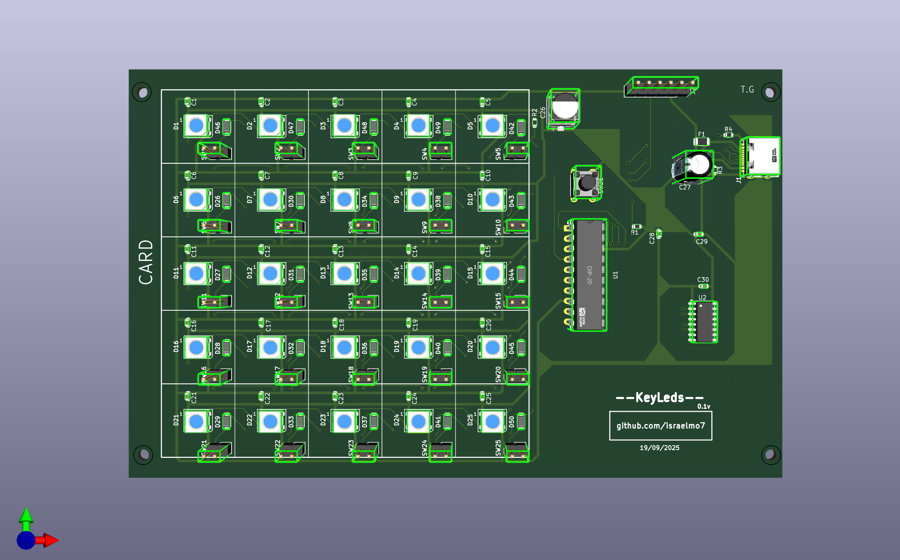
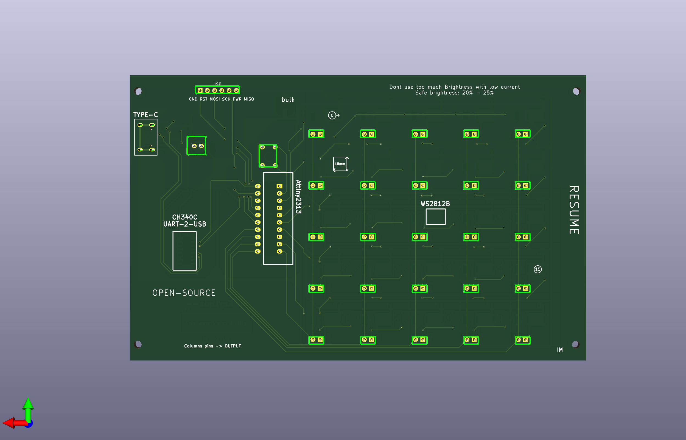
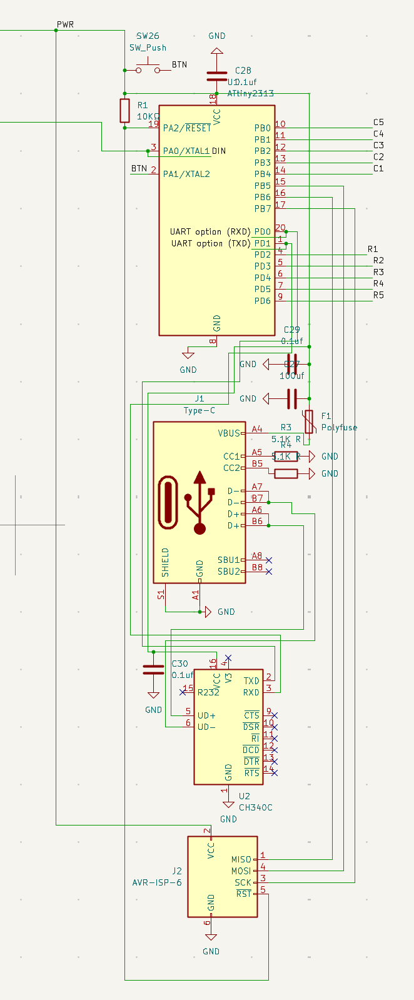
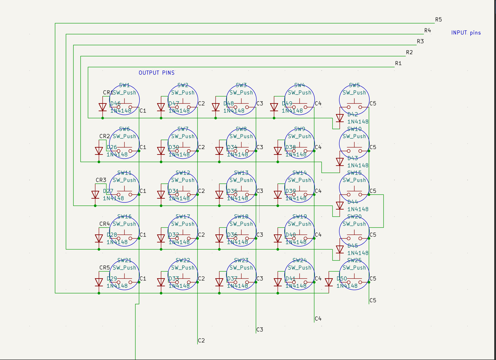
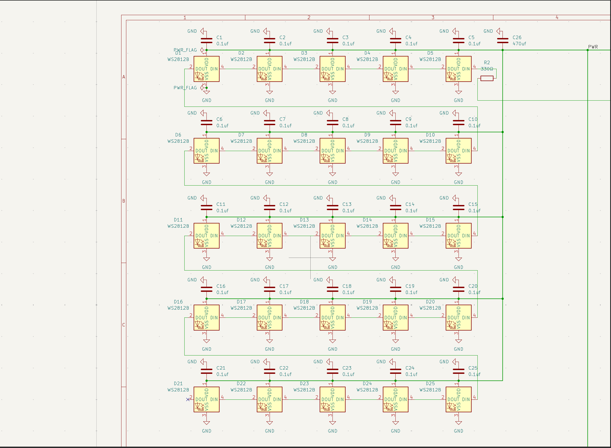
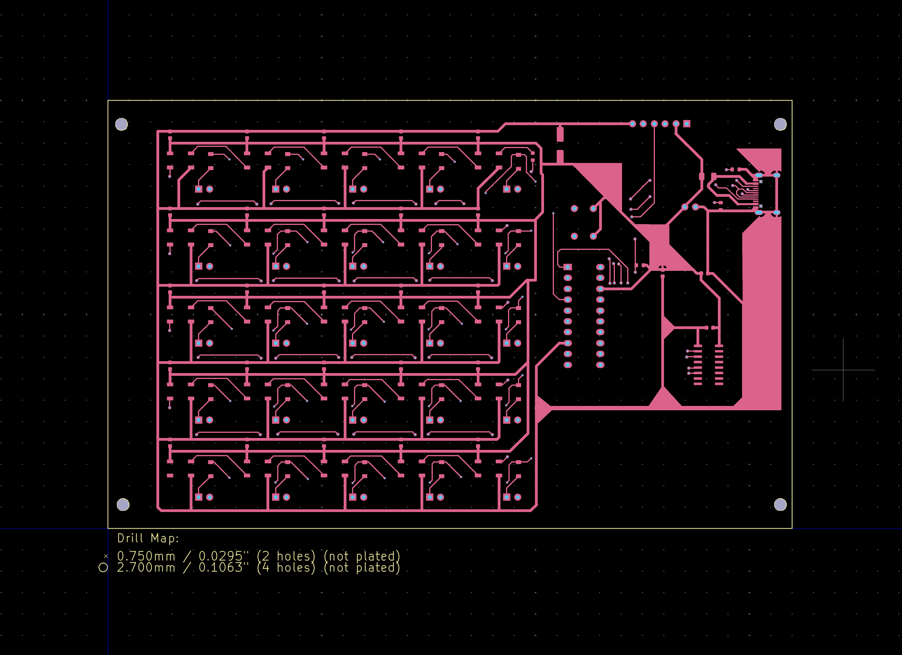
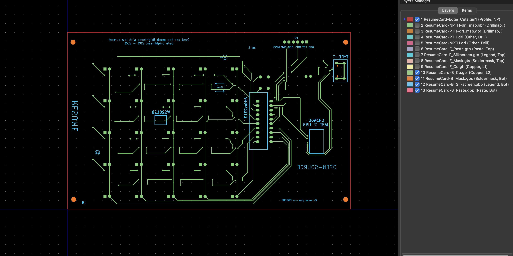

# ResumeCard

# ATtiny-Based Addressable LED Controller PCB

## 🧩 Overview
This project is a compact **ATtiny microcontroller board** designed to control **25 addressable LEDs** (with individual 2-pin headers for each LED).  
It’s powered via **USB Type-C** and includes interfaces for **firmware flashing** and **UART debugging**.  
The board is intended for use in custom LED panels, keypads, or modular lighting setups.

---

## ⚙️ Features

- **MCU:** ATtiny series microcontroller  
- **LED Outputs:** 25 × 2-pin headers  
  - Each header provides a dedicated input/output for an LED  
  - **Diodes included in the matrix** to prevent ghosting and unintended current paths  
  - **Each LED has a decoupling capacitor**, and LEDs are placed near the **BULK capacitor** for stable power  
- **Power Input:** USB Type-C connector  
  - Protected with onboard fuse and decoupling capacitors  
- **Programming Interface (ISP):** Standard 6-pin header for flashing firmware  
- **Debug Interface (UART):** Dedicated header for serial debugging via USB  
- **Additional Components:**  
  - Resistors, capacitors, and fuse for power protection and signal conditioning  
- **Footprints:** All component footprints were compared against datasheets and verified; layout was assisted using **EasyEDA**

---

## 🧠 Design Notes

- Designed in **KiCad**  
- Follows standard **DFM (Design for Manufacturability)** guidelines  
- Includes test pads for continuity and signal probing  
- **Diode matrix layout** is optimized to prevent ghosting while maintaining compact routing  
- Trace widths and clearances chosen for 5V / low-current operation  
- Local **decoupling capacitors** for both MCU and LED power rails ensure stable voltage  
- LEDs placed near **BULK capacitor** to reduce voltage drops during simultaneous switching

---

## ⚡ Power and Protection

- Input protected by a **fuse**  
- Type-C connector wired for 5V operation (no PD negotiation)  
- Local decoupling capacitors on MCU and LED power lines  

---

## 🧰 Programming

Use any **AVR ISP programmer** (e.g., USBasp, Atmel ICE, or Arduino as ISP).  
The board also supports **UART debugging via USB**, allowing serial monitoring of LED behavior.

---

## 📝 HOW TO USE

1. **ISP → Board**  
   - Connect your programmer to the ISP header  
2. **Computer → Board**  
   - Use AVR tools or Arduino IDE to flash firmware  
3. **Adding Software to Board**  
   - Upload LED control software / scripts (details TBD)  

---

## 3D

  
  

## Schematic 

  
  
  

## PCB 

  
  
