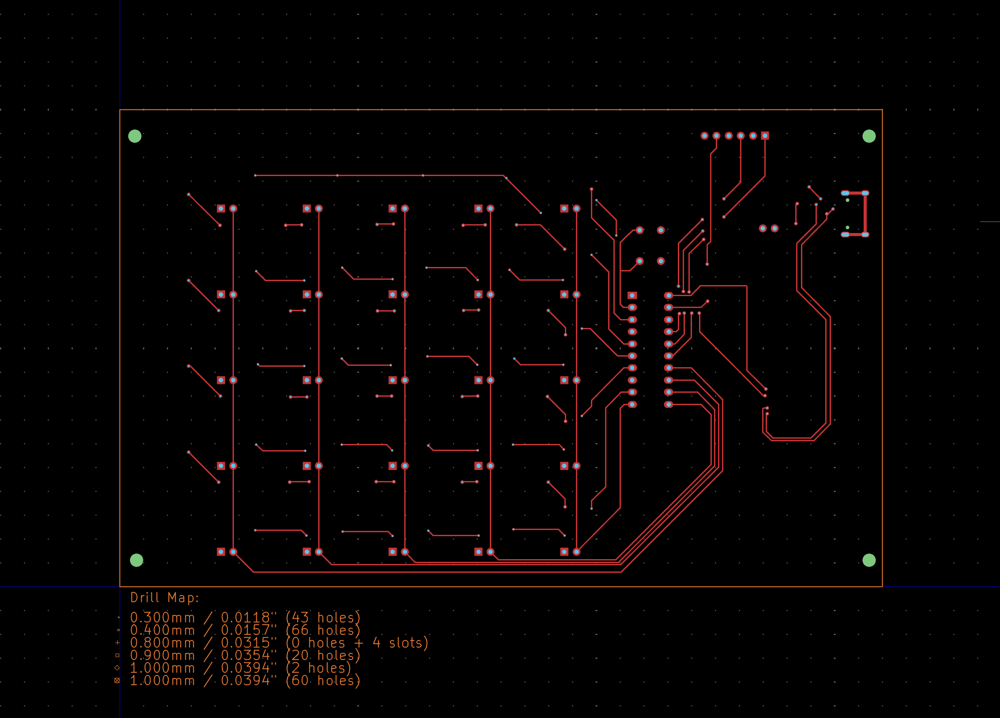

# ResumeCard

# ATtiny-Based Addressable LED Controller PCB

## 🧩 Overview
This project is a compact **ATtiny microcontroller board** designed to control **25 addressable LEDs** (with individual 2-pin headers for each LED).  
It’s powered via **USB Type-C** and includes interfaces for **firmware flashing** and **UART debugging**.  
The board is intended for use in custom LED panels, keypads, or modular lighting setups.

---

## ⚙️ Features

- **MCU:** ATtiny series microcontroller  
- **LED Outputs:** 25 × 2-pin headers  
  - Each header provides a dedicated input/output for an LED  
  - Diodes included in the matrix to prevent ghosting (keypad-style design)  
- **Power Input:** USB Type-C connector  
  - Protected with onboard fuse and decoupling capacitors  
- **Programming Interface (ISP):** Standard 6-pin header for flashing firmware  
- **Debug Interface (UART):** Dedicated header for serial debugging  
- **Additional Components:**  
  - Resistors, capacitors, and fuse for power protection and signal conditioning

---

## 🧠 Design Notes

- Designed in **KiCad**  
- Follows standard **DFM (Design for Manufacturability)** guidelines  
- Includes test pads for continuity and signal probing  
- Diode matrix layout minimizes ghosting when used as a keypad input circuit  
- Trace widths and clearances chosen for 5V / low-current operation

---

## ⚡ Power and Protection

- Input protected by a **fuse**
- Local **decoupling capacitors** for MCU and LED power rails
- Type-C connector wired for 5V operation (no PD negotiation)

---

## 🧰 Programming

Use any **AVR ISP programmer** (e.g. USBasp, Atmel ICE, or Arduino as ISP):

._.
## 3D

## Schematic 

## PCB 

